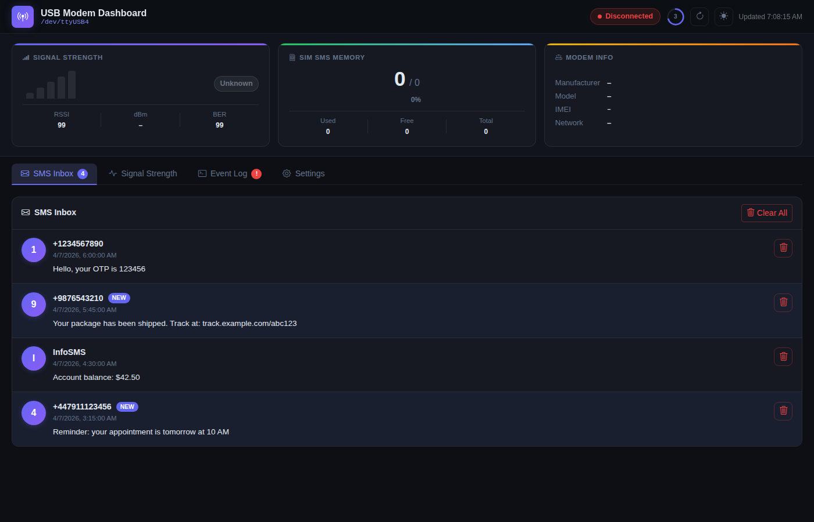
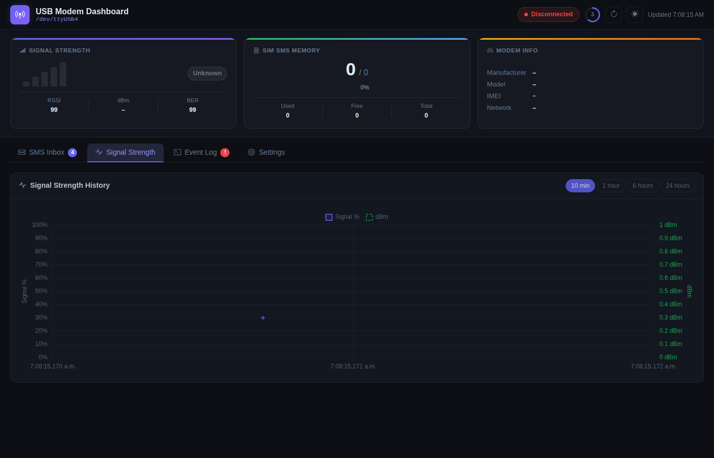
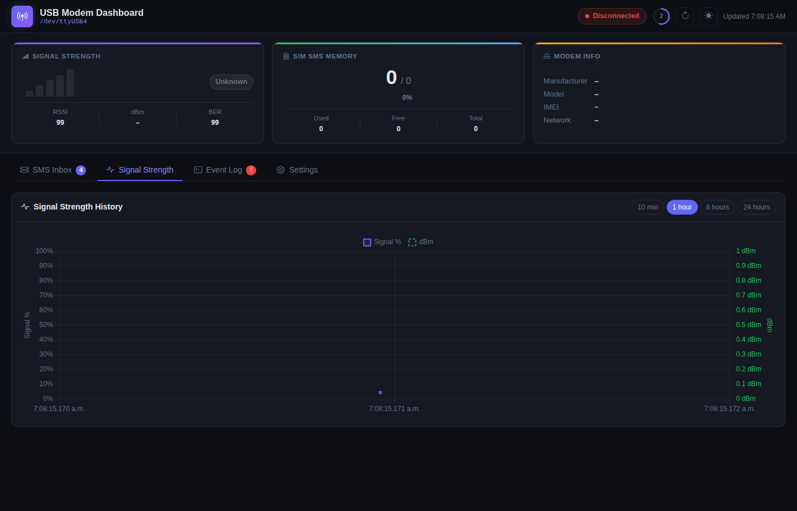
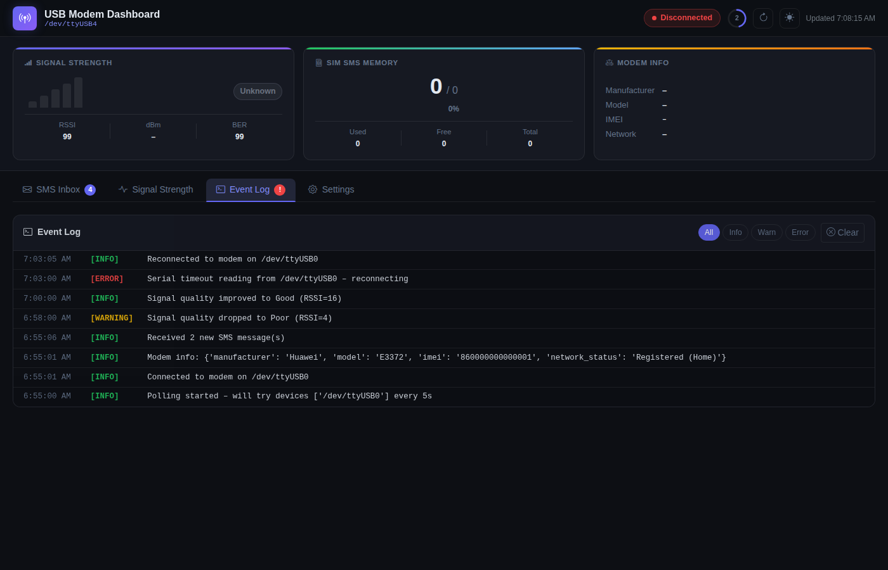
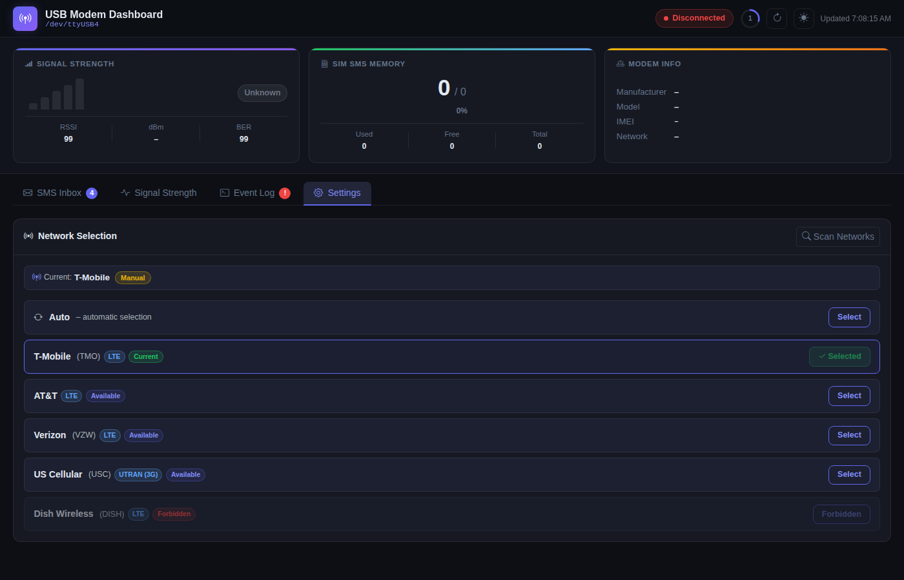
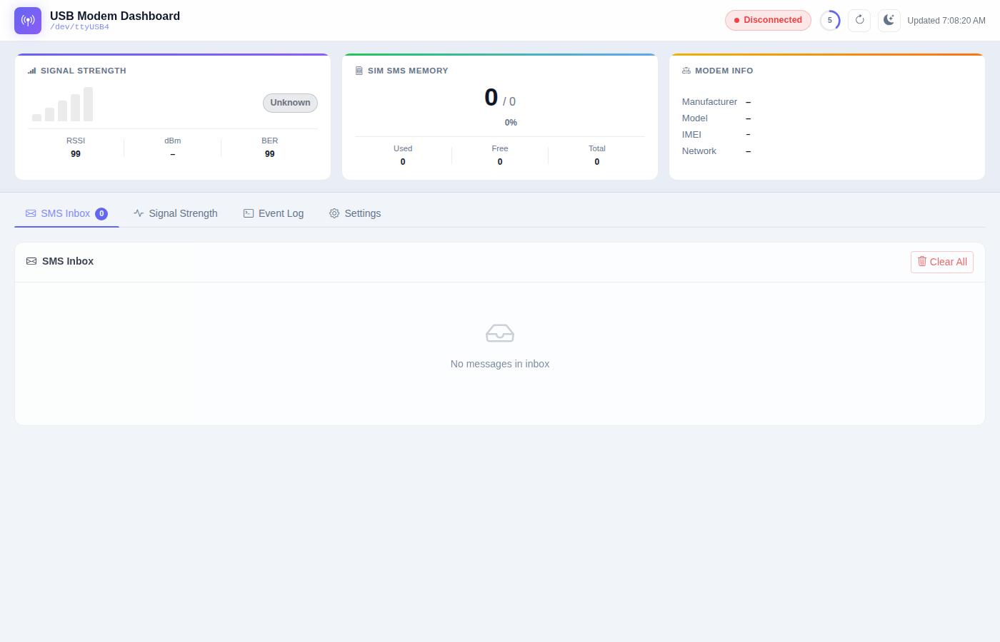
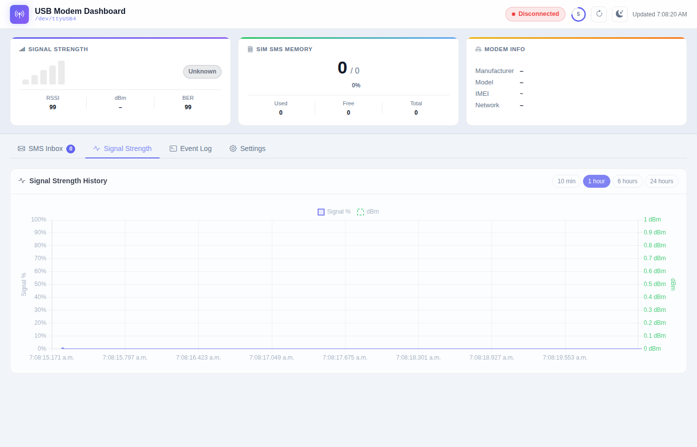
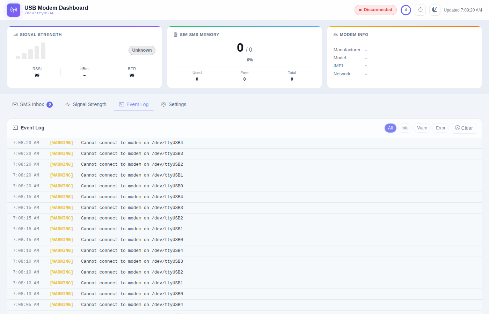
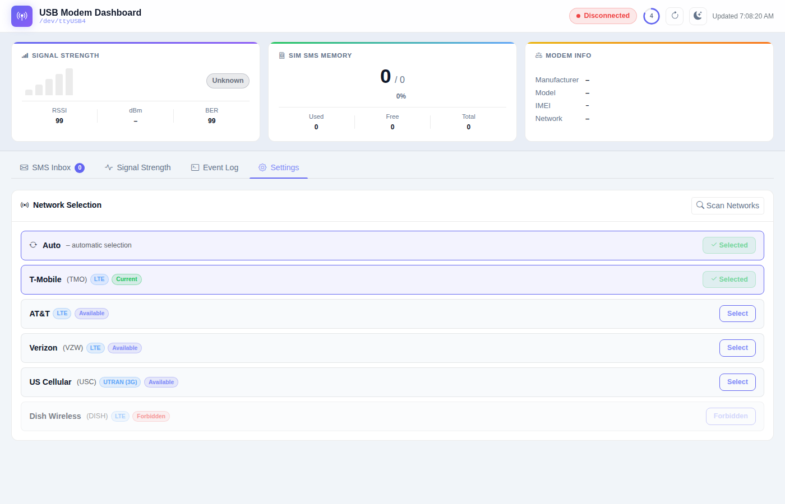

# USB Modem Dashboard

A **Dockerised web dashboard** for the *HSDPA USB STICK SIM Modem 7.2 Mbps 3G Wireless Network Adapter* (and compatible AT-command modems).

The dashboard connects to the modem over the host's `/dev/ttyUSB0` serial device, polls it every **5 seconds**, and presents:

- 📶 **Signal strength** – RSSI, dBm, quality badge, 5-bar colour-coded signal indicator (0 bars red → 5 bars green)
- 📈 **Signal history graph** – interactive Chart.js line chart (Signal % + dBm) with selectable time ranges: **10 min · 1 hour · 6 hours · 24 hours**
- 💾 **SIM SMS Memory** – used / free / total slots, fill bar
- 📱 **Modem Info** – manufacturer, model, IMEI, network registration status
- 📨 **SMS Inbox** – all messages on the SIM, with per-message delete
- 📋 **Event Log** – timestamped log of every modem event
- 📡 **Network Selection** – scan all networks visible to the SIM and manually lock to any operator (or restore automatic selection)
- 🌙 **Dark / Light mode** toggle (preference saved in `localStorage`)
- 🔄 **Auto-refresh** every 5 seconds with live countdown

History, received SMS and logs are **persisted to a Docker volume** and
reloaded automatically when the container restarts.


---

## Quick Start

```bash
# 1. Clone the repository
git clone https://github.com/masterlog80/sms-frontend2-copilot.git
cd sms-frontend2-copilot

# 2. Build and start the container (first run builds the image)
yes | docker image prune --all
docker build -t modem-dashboard .
#docker compose up -d --build

# 3. Deploy the composer file:
docker compose -f docker-compose.yml up -d --remove-orphans

# 4. Open the dashboard
```


---

## Screenshots

### Dark Mode



#### Signal Strength History (dark) – 10 min view



#### Signal Strength History (dark) – 1 hour view



#### Event Log (dark)



#### Network Selection – Settings tab (dark)



### Light Mode



#### Signal Strength History (light)



#### Event Log (light)



#### Network Selection – Settings tab (light)



---

## Prerequisites

| Requirement | Notes |
|---|---|
| Docker ≥ 24 | `docker --version` |
| Docker Compose ≥ 2.20 (plugin) or standalone `docker-compose` | `docker compose version` |
| USB modem plugged in as `/dev/ttyUSB0` | Adjust `MODEM_DEVICE` if yours differs |
| Host user in the `dialout` group (Linux) | `sudo usermod -aG dialout $USER` |

> **Tip – multiple ttyUSB ports:** HSDPA sticks often expose several serial
> interfaces.  If AT commands don't work on `ttyUSB0`, try `ttyUSB1` or
> `ttyUSB2` by changing the `MODEM_DEVICE` environment variable in
> `docker-compose.yml`.

---

## docker-compose.yml

```yaml
version: "3.9"

services:
  modem-dashboard:
    build:
      context: .
      dockerfile: Dockerfile
    image: modem-dashboard:latest
    container_name: modem-dashboard
    restart: unless-stopped

    # Privileged mode required to access /dev/ttyUSB0
    privileged: true

    # Device passthrough
    devices:
      - /dev/ttyUSB0:/dev/ttyUSB0
    # Uncomment below if your modem uses a different port:
    #   - /dev/ttyUSB1:/dev/ttyUSB1
    #   - /dev/ttyUSB2:/dev/ttyUSB2

    # Persistent data (SMS history, event log)
    volumes:
      - modem_data:/data

    # Published port
    ports:
      - "5000:5000"

    # Configuration (override as needed)
    environment:
      MODEM_DEVICE: /dev/ttyUSB0   # serial device inside the container
      POLL_INTERVAL: 5             # seconds between modem polls
      DATA_DIR: /data              # persistent data directory
      LOG_LEVEL: INFO              # DEBUG | INFO | WARNING | ERROR

    healthcheck:
      test: ["CMD", "python", "-c",
             "import urllib.request; urllib.request.urlopen('http://localhost:5000/api/status')"]
      interval: 15s
      timeout: 5s
      retries: 3
      start_period: 10s

volumes:
  modem_data:
    driver: local
```

---

## Configuration

All settings are environment variables passed via `docker-compose.yml`:

| Variable | Default | Description |
|---|---|---|
| `MODEM_DEVICE` | `/dev/ttyUSB0` | Host device path mapped into the container |
| `POLL_INTERVAL` | `5` | Seconds between each modem poll |
| `DATA_DIR` | `/data` | Directory for persistent JSON files |
| `LOG_LEVEL` | `INFO` | Python log level (`DEBUG`, `INFO`, `WARNING`, `ERROR`) |

---

## REST API

The Flask backend exposes the following endpoints (consumed by the UI):

| Method | Path | Description |
|---|---|---|
| `GET` | `/api/status` | Signal, memory, modem info, connection state |
| `GET` | `/api/sms` | All persisted SMS messages |
| `DELETE` | `/api/sms/<n>` | Delete SMS at list position `n` |
| `DELETE` | `/api/sms` | Delete **all** SMS messages |
| `GET` | `/api/logs` | Event log entries |
| `DELETE` | `/api/logs` | Clear event log |
| `GET` | `/api/signal_history` | Signal strength history (optional `?since=<ISO>` parameter) |
| `POST` | `/api/refresh` | Trigger an immediate modem poll |
| `GET` | `/api/networks` | Scan for available networks (AT+COPS=?, may take up to 60 s) |
| `POST` | `/api/networks/select` | Select an operator: `{"mode":"auto"}` or `{"mode":"manual","numeric":"<MCC+MNC>"}` |

---

## Persistent Data

Two JSON files are written to the volume:

| File | Contents |
|---|---|
| `/data/sms.json` | All received SMS (merged, never overwritten unless you delete) |
| `/data/logs.json` | Up to 500 most-recent event log entries |
| `/data/signal_history.json` | Up to 17 280 signal readings (~24 h at 5 s intervals) |

To back up or inspect the data on the host:

```bash
# Find the volume mount path
docker volume inspect sms-frontend2-copilot_modem_data

# Or copy files out
docker cp modem-dashboard:/data ./modem-data-backup
```

---

## Stopping & Removing

```bash
# Stop the container (data is preserved in the volume)
docker compose down

# Stop AND remove the persistent volume
docker compose down -v
```

---

## Project Structure

```
.
├── docker-compose.yml        # Compose file (the main deployment YAML)
├── Dockerfile                # Multi-stage image build
├── app/
│   ├── main.py               # Flask backend + polling loop
│   ├── modem.py              # AT-command modem interface (pyserial)
│   ├── requirements.txt      # Python dependencies
│   └── static/
│       ├── index.html        # Single-page UI (Bootstrap 5)
│       ├── app.js            # Frontend logic (vanilla JS)
│       └── style.css         # Custom styles + dark/light variables
└── README.md
```

---

## Troubleshooting

### Modem not detected

```bash
# Check if the device appears on the host
ls -la /dev/ttyUSB*

# Grant access without rebooting
sudo chmod a+rw /dev/ttyUSB0

# Confirm AT command interface works
screen /dev/ttyUSB0 115200
# then type: AT  (should reply OK)
```

### Permission denied on /dev/ttyUSB0

Add your user to the `dialout` group and log out / in:

```bash
sudo usermod -aG dialout $USER
```

### Dashboard shows "Disconnected"

1. Check the Event Log panel for error messages.
2. Try a different `MODEM_DEVICE` value (`ttyUSB1`, `ttyUSB2`, etc.).
3. Verify the container is running in privileged mode (`docker inspect modem-dashboard | grep Privileged`).

### Rebuild after code changes

```bash
docker compose up -d --build
```
