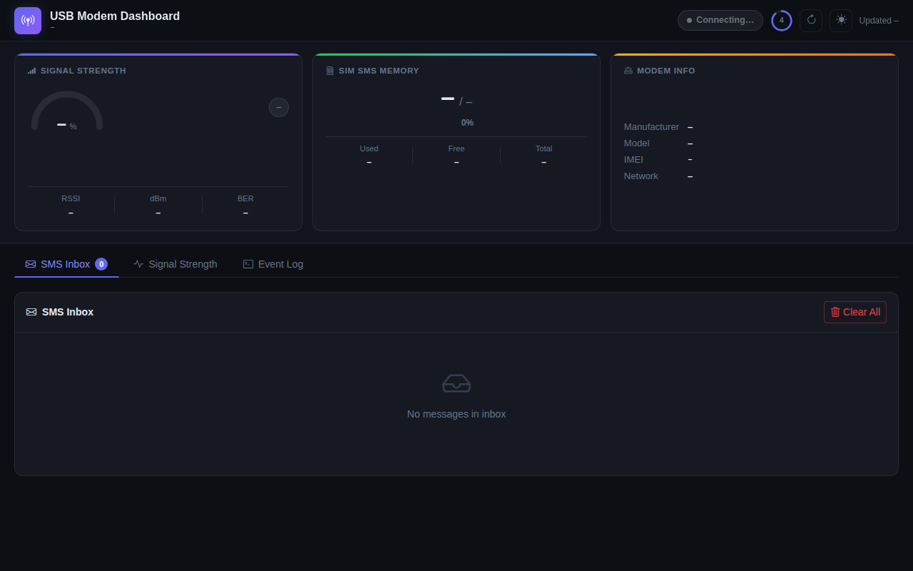
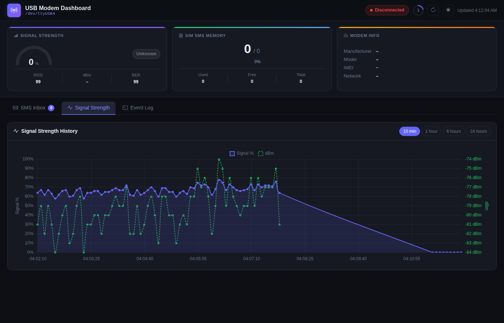
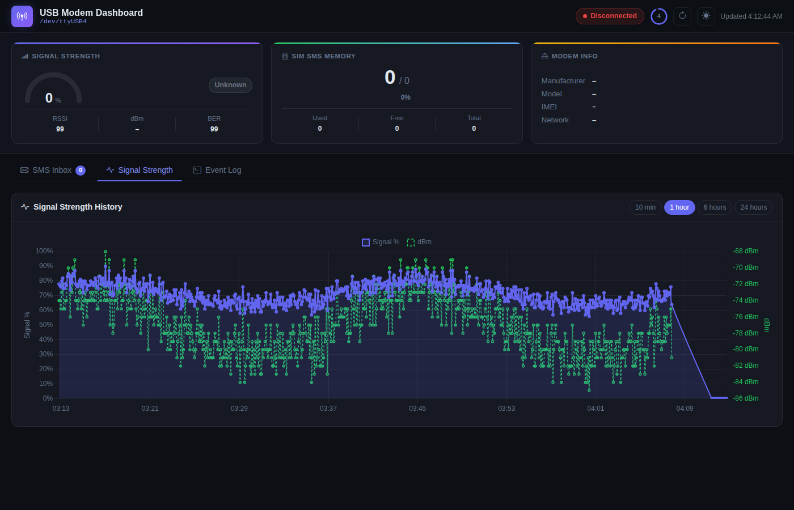
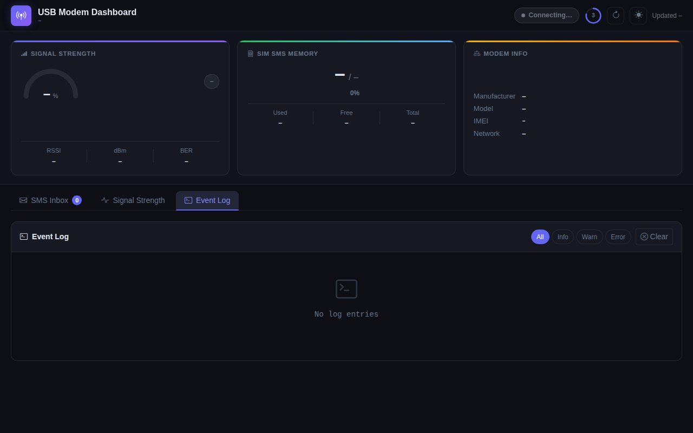
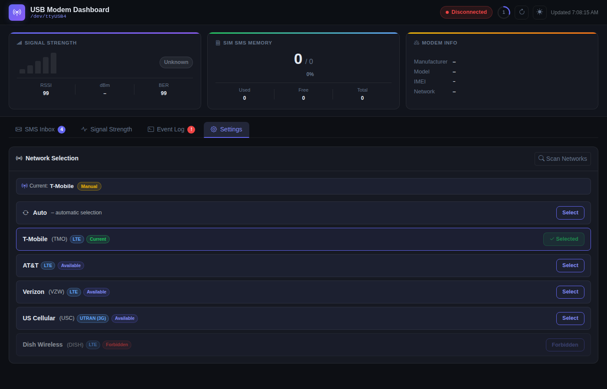
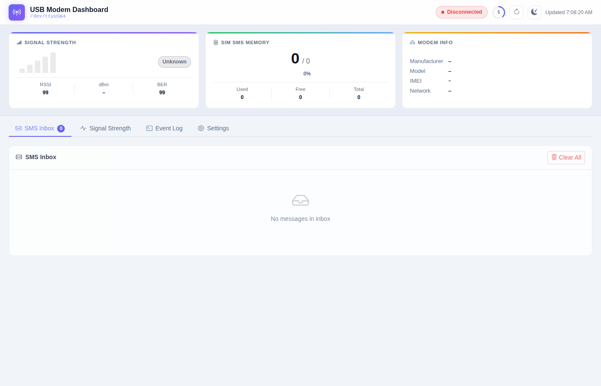
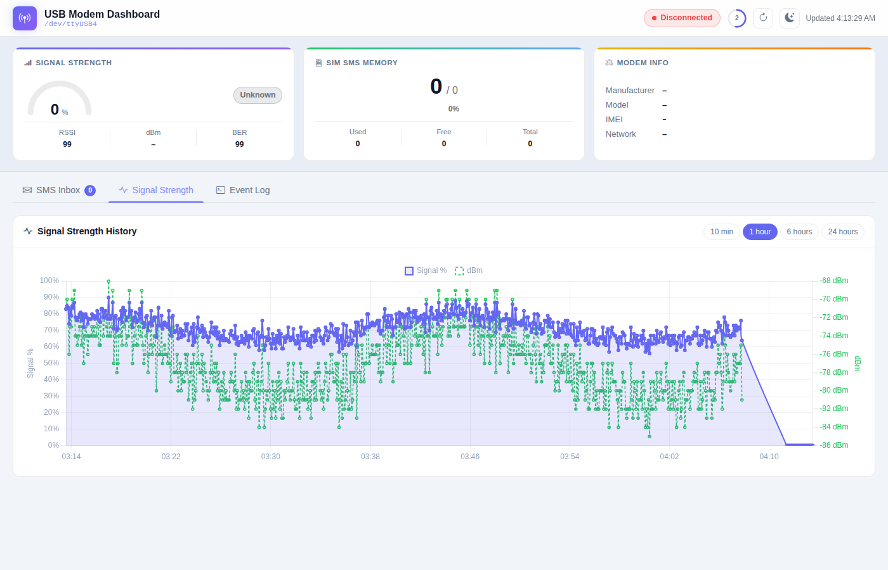
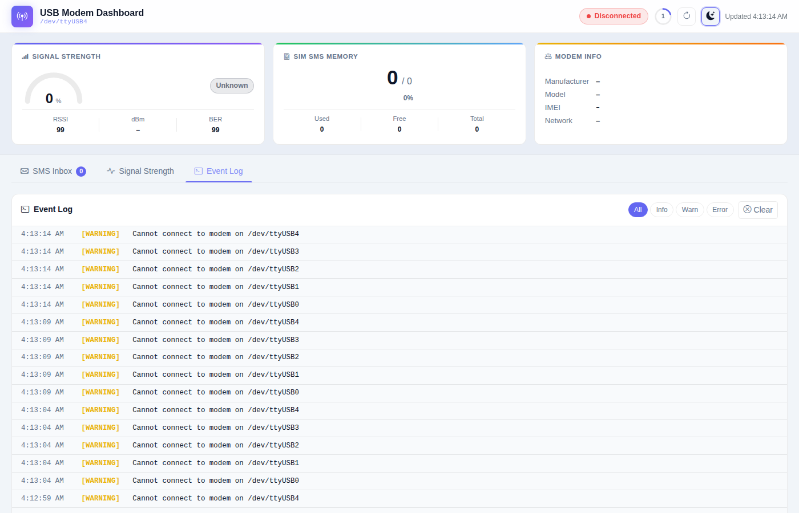
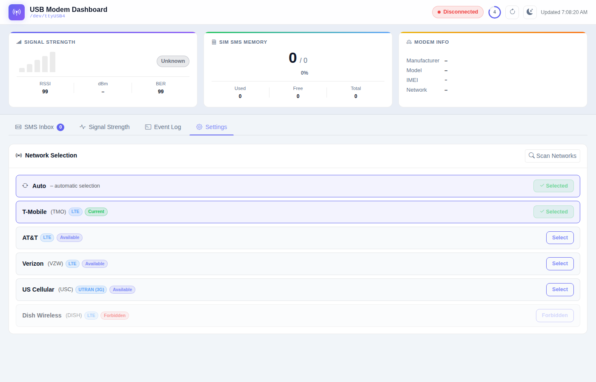

# USB Modem Dashboard

A Dockerized web dashboard for USB stick SIM modems and compatible AT-command devices. Connects to the modem over `/dev/ttyUSB0`, polls it every 5 seconds, and presents signal strength, SMS inbox, network info, and event logs in a clean dark/light-mode UI.

---

## Features

- 📶 **Signal strength** – RSSI, dBm, quality badge, 5-bar colour-coded indicator (0 bars red → 5 bars green)
- 📈 **Signal history graph** – interactive Chart.js line chart (Signal % + dBm) with selectable time ranges: **10 min · 1 hour · 6 hours · 24 hours**
- 💾 **SIM SMS memory** – used / free / total slots with fill bar
- 📱 **Modem info** – manufacturer, model, IMEI, network registration status
- 📨 **SMS inbox** – all messages on the SIM, with per-message delete
- 📋 **Event log** – timestamped log of every modem event with level filtering
- 📡 **Network selection** – scan all visible operators and manually lock to any (or restore automatic selection)
- 🌙 **Dark / Light mode** toggle (preference saved in `localStorage`)
- 🔄 **Auto-refresh** every 5 seconds with live countdown
- 💾 **Persistent data** – SMS history, signal log, and event log survive container restarts via Docker volume

---

## Quick Start

### Prerequisites

| Requirement | Notes |
|---|---|
| Docker ≥ 24 | `docker --version` |
| Docker Compose ≥ 2.20 | `docker compose version` |
| USB modem on `/dev/ttyUSB0` | Adjust `MODEM_DEVICE` if yours differs |
| Host user in `dialout` group | `sudo usermod -aG dialout $USER` |
| `curl` and `jq` | `jq` optional — pending PR check is skipped with a warning if missing |

> **Tip – multiple ttyUSB ports:** HSDPA sticks often expose several serial interfaces. If AT commands don't work on `ttyUSB0`, try `ttyUSB1` or `ttyUSB2` via the `MODEM_DEVICE` environment variable.

### Clone & build

```bash
# Optional custom pre-deploy operations (e.g. copying or deleting files).
# Runs after the image is built, before deployment. Leave empty to skip.
OPERATIONS=""

echo ""
echo ">> Step 1/10: GitHub authentication"
GH_TOKEN="${GH_TOKEN:-$GITHUB_TOKEN}"
if [[ -n "$GH_TOKEN" ]]; then
  echo "   Using existing GH_TOKEN/GITHUB_TOKEN from the environment."
else
  read -s -p "   GitHub token (leave blank to use public access): " GH_TOKEN
  echo
fi

REPO="masterlog80/sms-frontend2-copilot"
AUTH_HEADER=()
[[ -n "$GH_TOKEN" ]] && AUTH_HEADER=(-H "Authorization: token ${GH_TOKEN}")

echo ""
echo ">> Step 2/10: Checking for open pending pull requests"
CLONE_REF=""
if command -v jq &>/dev/null; then
  PR_JSON=$(curl -s "${AUTH_HEADER[@]}" -H "Accept: application/vnd.github+json" \
    "https://api.github.com/repos/${REPO}/pulls?state=open")

  CANDIDATES=()
  while IFS=$'\t' read -r pr_number pr_branch pr_title; do
    [[ -z "$pr_number" ]] && continue
    CANDIDATES+=("${pr_number}"$'\t'"${pr_branch}"$'\t'"${pr_title}")
  done < <(echo "$PR_JSON" | jq -r '.[] | select(.draft == false) | [.number, .head.ref, .title] | @tsv')

  if [[ ${#CANDIDATES[@]} -gt 0 ]]; then
    echo "   Open pending PR(s) found (not yet merged to main):"
    for i in "${!CANDIDATES[@]}"; do
      IFS=$'\t' read -r num branch title <<< "${CANDIDATES[$i]}"
      echo "     $((i+1))) #${num} ${title} (branch: ${branch})"
    done
    echo "     0) none - use main"
    read -p "   Which one should be pulled? [0-${#CANDIDATES[@]}, default 0]: " choice
    choice="${choice:-0}"
    if [[ "$choice" =~ ^[1-9][0-9]*$ ]] && (( choice <= ${#CANDIDATES[@]} )); then
      IFS=$'\t' read -r _ CLONE_REF _ <<< "${CANDIDATES[$((choice-1))]}"
    fi
  else
    echo "   No open pending PRs - will use main."
  fi
else
  echo "   jq not found - skipping pending PR check, will use main."
fi

echo ""
echo ">> Step 3/10: Cloning repository"
CLONE_ARGS=()
[[ -n "$CLONE_REF" ]] && CLONE_ARGS=(-b "$CLONE_REF")
echo "   Ref: ${CLONE_REF:-main (default branch)}"

if [[ -n "$GH_TOKEN" ]]; then
  # Auth header is passed via git config, not embedded in the URL, so it's
  # never written to .git/config or left lying around on disk.
  git -c http.extraHeader="Authorization: Basic $(printf 'x-access-token:%s' "$GH_TOKEN" | base64 -w0)" \
    clone "${CLONE_ARGS[@]}" "https://github.com/masterlog80/sms-frontend2-copilot.git"
else
  git clone "${CLONE_ARGS[@]}" "https://github.com/masterlog80/sms-frontend2-copilot.git"
fi
cd sms-frontend2-copilot

echo ""
echo ">> Step 4/10: Checking image version on the registry"
REGISTRY="zot.salvetti.info"
IMAGE_NAME="modem-dashboard"

CURRENT_VERSION=$(curl -s "https://${REGISTRY}/v2/${IMAGE_NAME}/tags/list" 2>/dev/null \
  | jq -r '.tags[]?' 2>/dev/null \
  | grep -E '^[0-9]+\.[0-9]+$' \
  | sort -t. -k1,1n -k2,2n \
  | tail -1)

if [[ -n "$CURRENT_VERSION" ]]; then
  SUGGESTED_VERSION=$(awk -v v="$CURRENT_VERSION" 'BEGIN{printf "%.1f", v+0.1}')
  echo "Newest image on ${REGISTRY}/${IMAGE_NAME}: ${CURRENT_VERSION}"
  read -p "Use next version ${SUGGESTED_VERSION}? [Y/n]: " use_suggested
  use_suggested="${use_suggested:-Y}"
  if [[ "$use_suggested" =~ ^[Yy]$ ]]; then
    NEW_VERSION="$SUGGESTED_VERSION"
  else
    read -p "Enter version to use: " NEW_VERSION
  fi
else
  echo "Could not determine an existing version on ${REGISTRY}/${IMAGE_NAME} (unreachable, no jq, or no versioned tags) - keeping the version already set in the Dockerfile."
fi

if [[ -n "$NEW_VERSION" ]]; then
  sed -i.bak -E "s|(org\.opencontainers\.image\.version=\")[^\"]*(\")|\1${NEW_VERSION}\2|" Dockerfile
fi

echo ""
echo ">> Step 5/10: Updating Dockerfile metadata"
CREATED=$(date -u +"%Y-%m-%dT%H:%M:%SZ")

sed -i.bak -E 's@(org\.opencontainers\.image\.created=")[^"]*"@\1'${CREATED}'"@' Dockerfile
echo "   org.opencontainers.image.created set to ${CREATED}"

echo ""
echo ">> Step 6/10: Cleaning up old Docker images and build cache"
yes | docker image prune --all
yes | docker builder prune --all

echo ""
echo ">> Step 7/10: Building Docker image"
docker build -t modem-dashboard .

echo ""
echo ">> Step 8/10: Running custom operations"
if [[ -n "$OPERATIONS" ]]; then
  echo "   Running: ${OPERATIONS}"
  eval "$OPERATIONS"
else
  echo "   OPERATIONS is empty - skipping."
fi

echo ""
echo ">> Step 9/10: Detecting deployment target"
DEPLOY_TARGET=""
if command -v k3s &>/dev/null || systemctl is-active --quiet k3s 2>/dev/null || [[ -f /etc/rancher/k3s/k3s.yaml ]]; then
  DEPLOY_TARGET="k3s"
elif command -v docker &>/dev/null; then
  DEPLOY_TARGET="docker"
fi

if [[ -z "$DEPLOY_TARGET" ]]; then
  read -p "   Could not auto-detect Docker or K3S. Deploy target: (d)ocker or (k)3s? [d/k]: " target_choice
  [[ "$target_choice" =~ ^[Kk]$ ]] && DEPLOY_TARGET="k3s" || DEPLOY_TARGET="docker"
fi
echo "   Detected environment: ${DEPLOY_TARGET}"

read -p "   Proceed with deployment on ${DEPLOY_TARGET}? [Y/n] (n to skip): " confirm_deploy
confirm_deploy="${confirm_deploy:-Y}"
[[ "$confirm_deploy" =~ ^[Yy]$ ]] || DEPLOY_TARGET="skip"

if [[ "$DEPLOY_TARGET" == "k3s" ]]; then
  echo "   Applying k3s-deploy.yaml..."
  kubectl apply -f k3s-deploy.yaml
elif [[ "$DEPLOY_TARGET" == "docker" ]]; then
  echo "   Starting with docker compose..."
  docker compose -f docker-compose.yml up -d --remove-orphans
else
  echo "   Skipping deployment."
fi

echo ""
echo ">> Step 10/10: Tagging and pushing the image"
VERSION=$(grep 'org.opencontainers.image.version' Dockerfile | sed -E 's/.*version="([^"]+)".*/\1/')
docker tag modem-dashboard:latest zot.salvetti.info/modem-dashboard:${VERSION}
docker tag modem-dashboard:latest zot.salvetti.info/modem-dashboard:latest
echo "   Tagged as ${VERSION} and latest."

read -p "   Push images zot.salvetti.info/modem-dashboard:${VERSION} and zot.salvetti.info/modem-dashboard:latest? [Y/N] " answer && [[ "$answer" =~ ^[Yy]$ ]] && docker push zot.salvetti.info/modem-dashboard:${VERSION} && docker push zot.salvetti.info/modem-dashboard:latest

echo ""
echo ">> Cleaning up build cache"
yes | docker image prune --all
yes | docker builder prune --all

echo ""
echo "Completed."
```

### Access the UI

```
http://localhost:5000
```

### Uninstall

```bash
# Stop the container (data is preserved in the volume)
docker compose down

# Stop AND remove the persistent volume
docker compose down -v
```

---

## Screenshots

### Dark Mode


#### Signal Strength History (dark) – 10 min view


#### Signal Strength History (dark) – 1 hour view


#### Event Log (dark)


#### Network Selection – Settings tab (dark)


### Light Mode


#### Signal Strength History (light)


#### Event Log (light)


#### Network Selection – Settings tab (light)


---

## Docker Compose

```yaml
version: "3.9"

services:
  modem-dashboard:
    build:
      context: .
      dockerfile: Dockerfile
    image: modem-dashboard:latest
    container_name: modem-dashboard
    restart: unless-stopped
    privileged: true
    devices:
      - /dev/ttyUSB0:/dev/ttyUSB0
      # Uncomment if your modem uses a different port:
      # - /dev/ttyUSB1:/dev/ttyUSB1
      # - /dev/ttyUSB2:/dev/ttyUSB2
    volumes:
      - modem_data:/data
    ports:
      - "5000:5000"
    environment:
      MODEM_DEVICE: /dev/ttyUSB0
      POLL_INTERVAL: 5
      DATA_DIR: /data
      LOG_LEVEL: INFO
    healthcheck:
      test: ["CMD", "python", "-c",
             "import urllib.request; urllib.request.urlopen('http://localhost:5000/api/status')"]
      interval: 15s
      timeout: 5s
      retries: 3
      start_period: 10s

volumes:
  modem_data:
    driver: local
```

---

## Environment Variables

| Variable | Default | Description |
|---|---|---|
| `MODEM_DEVICE` | `/dev/ttyUSB0` | Serial device path |
| `POLL_INTERVAL` | `5` | Seconds between modem polls |
| `FORWARD_DELAY` | `30` | Seconds to wait before forwarding SMS (allows multipart messages to be assembled) |
| `DATA_DIR` | `/data` | Directory for persistent JSON files |
| `LOG_LEVEL` | `INFO` | Python log level (`DEBUG`, `INFO`, `WARNING`, `ERROR`) |

---

## REST API

| Method | Path | Description |
|---|---|---|
| `GET` | `/api/status` | Signal, memory, modem info, connection state |
| `GET` | `/api/sms` | All persisted SMS messages |
| `DELETE` | `/api/sms/<n>` | Delete SMS at list position `n` |
| `DELETE` | `/api/sms` | Delete all SMS messages |
| `GET` | `/api/logs` | Event log entries |
| `DELETE` | `/api/logs` | Clear event log |
| `GET` | `/api/signal_history` | Signal history (optional `?since=<ISO>`) |
| `POST` | `/api/refresh` | Trigger an immediate modem poll |
| `GET` | `/api/networks` | Scan for available operators (AT+COPS=?, up to 60 s) |
| `POST` | `/api/networks/select` | Select operator: `{"mode":"auto"}` or `{"mode":"manual","numeric":"<MCC+MNC>"}` |

---

## Persistent Data

| File | Contents |
|---|---|
| `/data/sms.json` | All received SMS (merged; never overwritten unless deleted) |
| `/data/logs.json` | Up to 500 most-recent event log entries |
| `/data/signal_history.json` | Up to 17 280 signal readings (~24 h at 5 s intervals) |

Backup or inspect on the host:

```bash
docker cp modem-dashboard:/data ./modem-data-backup
```

---

## Troubleshooting

**Modem not detected**
```bash
ls -la /dev/ttyUSB*
sudo chmod a+rw /dev/ttyUSB0
# Verify AT interface: screen /dev/ttyUSB0 115200  then type: AT
```

**Permission denied on `/dev/ttyUSB0`**
```bash
sudo usermod -aG dialout $USER  # then log out and back in
```

**Dashboard shows "Disconnected"**: Check the Event Log panel, try a different `MODEM_DEVICE` value, and confirm the container is running with `privileged: true`.

---

## Project Structure

```
.
├── docker-compose.yml
├── Dockerfile
├── app/
│   ├── main.py               # Flask backend + polling loop
│   ├── modem.py              # AT-command modem interface (pyserial)
│   ├── requirements.txt
│   └── static/
│       ├── index.html        # Single-page UI (Bootstrap 5)
│       ├── app.js
│       └── style.css
└── README.md
```

---

## License

MIT
